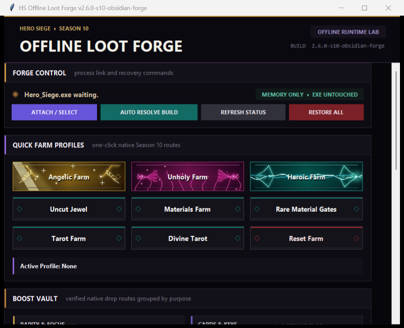

# HS Offline Loot Forge

Runtime-only target farming tool for **Hero Siege Season 10 offline play**.

> Current release: **v2.7.8 — Maledict & Mythic Jewels**
> Part of the [Hero Siege Offline Toolkit](https://github.com/falorfrozen-cmd/hero-siege-offline-toolkit).

## What changed in v2.7.8

- **Maledict Uncut Jewel** now really drops Maledict jewels. It used to ask the game for the
  wrong prefix, so you got tier S jewels but almost never a Maledict one.
- Maledict jewels now also get **Maledict's own stats**. Before, only the name and the tier
  were Maledict while the stats still came from the wrong prefix - which is why the jewel
  did not grant its skill.
- **Uncut Jewel -> Mythic (purple)** makes Uncut Jewels drop purple instead of blue. The real
  rarity changes, so the name and the stat roll change with it.
- **Suffix Tier -> S** rolls the top suffix tier every time.
- Turning on a jewel route switches the purple option on for you, and off again when you
  switch the route off.
- Fixed the red **MISMATCH** that appeared on the Mythic button after you switched it on.
- Loot Forge now finds what it needs by searching the running game, so it keeps working
  across more Hero Siege builds instead of breaking on every update.
- The whole application, including every log line, is now in English.

## Verified Season 10 features

The list below is what has been confirmed working in game. The two new jewel options
from this release (Mythic purple and the Maledict stat fix) are new and still being
tested by players.

### Rarity and equipment

- Angelic / SS drops and Angelic Focus
- Unholy Focus
- Heroic Focus
- Satanic Items
- Unique Flasks
- Relics

### Cards, keys and currency

- Tarot Cards and native Divine Tarot
- Codex
- Angelic Keys, normal Keys and Dungeon Keys
- Satanic Dice

### Charms and gems

- Normal, Angelic, Unholy and Satanic/Set Charms
- Uncut Jewels (native Jewel category)
- Maledict Uncut Jewels
- Incarnation Gems (separate green Gem category)
- Boss Gems, including the native Season 10 gem pool

### Materials and crafting

- Ore Materials and Essence of Chaos
- Random Orbs
- Life / Mana Flasks
- Satanic Crystal
- Blacksmith's Mallet
- Destiny Shard
- Gypsy's Prophecy and Prophet's Wisdom
- Runes and Reflection

## Safety model

- **Offline / single-player only.**
- The tool writes only to the running `Hero_Siege.exe` process.
- The game executable on disk is never modified.
- **Restore All**, closing Loot Forge, or restarting the game restores a clean runtime state.
- Only one target route should be used at a time.
- Boss Parts, standalone Set Charm focus and unverified Heroic Charm focus are intentionally absent.

## Download and use

1. Download the latest ZIP from [Releases](https://github.com/falorfrozen-cmd/Hs-Offline-Loot-Forge/releases/latest).
2. Extract the ZIP.
3. Start Hero Siege using **Launch Without EAC**, then enter offline mode.
4. Run `HSOfflineLootForge.exe` and accept the administrator prompt.
5. Click **Attach / Select**, then choose one Quick Farm profile or Boost Vault route.
6. Use **Restore All** before switching to a different farming target.

See [HSOfflineLootForge_INSTRUCTIONS_EN.txt](HSOfflineLootForge_INSTRUCTIONS_EN.txt) for detailed instructions and troubleshooting.

## Build notes

- Target: Windows 64-bit
- Runtime: standalone PyInstaller build
- Source engine version shown in the title: `v2.7.8-s10-english-only`
- Release binaries are community builds and are not code-signed, so Windows SmartScreen may display a warning.

## Disclaimer

This project is not affiliated with Hero Siege or Panic Art Studios. Use it at your own risk and keep backups of important offline save files.
